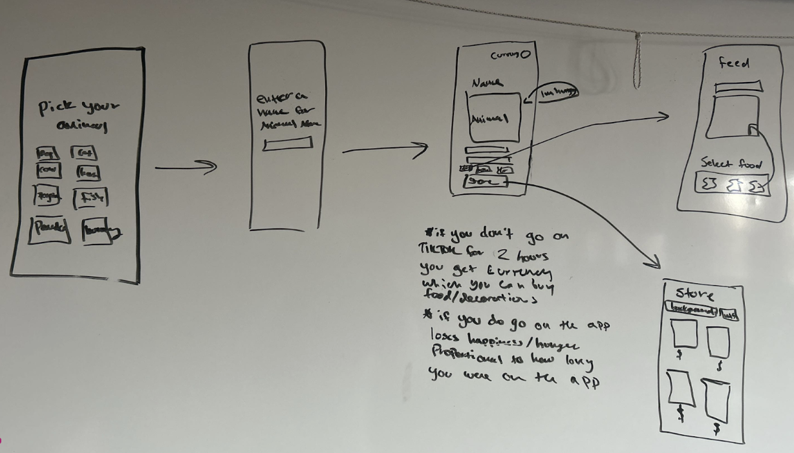

# How to run
- download the Expo Go app
- clone the repo, and run:
   - npm install
   - npx expo start

# Carleton Gittogether S26
4/10/26 - 4/11/26
Hackathon

### Wireframes

## Overview
You adopted a pet! Start a study timer to earn food to feed your pet. The longer the timer the better the food and the happier your pet gets.

### User flow
* Choose your pet
* Name your pet
* Pick a timer
* Keep your pet happy!

### Working features
[Demo](https://youtube.com/shorts/ao7x69_afSs?feature=share)

### Future improvements
* More pet options
* More food options
* More health bars such as sleep
* Store to buy toys and accessories for your pet
* Dark mode
* Tracking of screen time 
    * (Inital idea! Needed acess to Apple’s API) 
